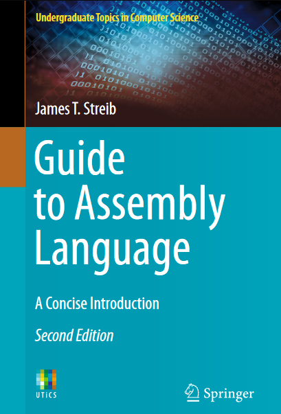

# Guia para a Linguagem Assembly - Soluções

Este repositório contém as soluções para os exercícios do livro _Guide to Assembly Language - A Concise Introduction, Second Edition_ de James T. Streib. As soluções foram desenvolvidas como parte da disciplina _Arquitetura e Organização de Computadores I_ na UFC Campus Quixadá, ministrada pelo professor João Marcelo.

## Capítulos

As soluções estão organizadas por capítulos. Cada capítulo possui seu próprio diretório com os exercícios resolvidos em formato Markdown e uma pasta "codigos" contendo os arquivos de código assembly necessários. Todas as soluções foram revisadas pelo professor João Marcelo, contendo as anotações necessárias quando erradas.

- [Capítulo 01 - Variáveis e Registradores](capitulo01)
- [Capítulo 02 - Entrada e Saída](capitulo02)
- [Capítulo 03 - Soluções Aritméticas](capitulo03)
- [Capítulo 04 - Estruturas de Seleção](capitulo04)
- [Capítulo 05 - Estruturas de Iteração](capitulo05)
- [Capítulo 06 - Lógica binária e Pilhas](capitulo06)
- [Capítulo 07 - Macros e Procedimentos](capitulo07)
- [Capítulo 08 - Arrays](capitulo08)
- [Capítulo 09 - Strings](capitulo09)
- [Capítulo 10 - Instruções de Ponto flutuante](capitulo10)

Sinta-se à vontade para explorar as soluções, estudar os conceitos de linguagem assembly e usar este repositório como referência em sua jornada de aprendizado em Linguagem Assembly.